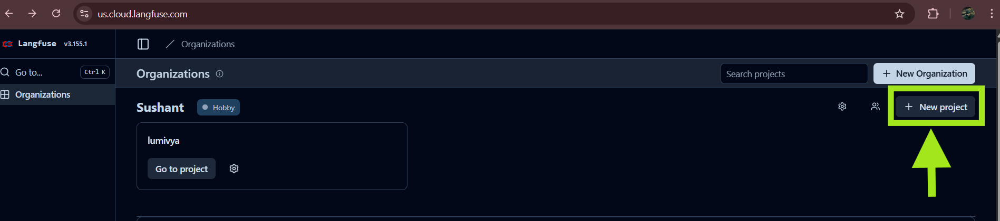
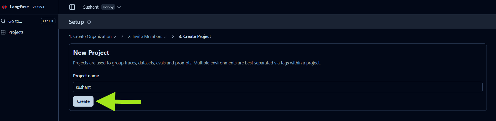
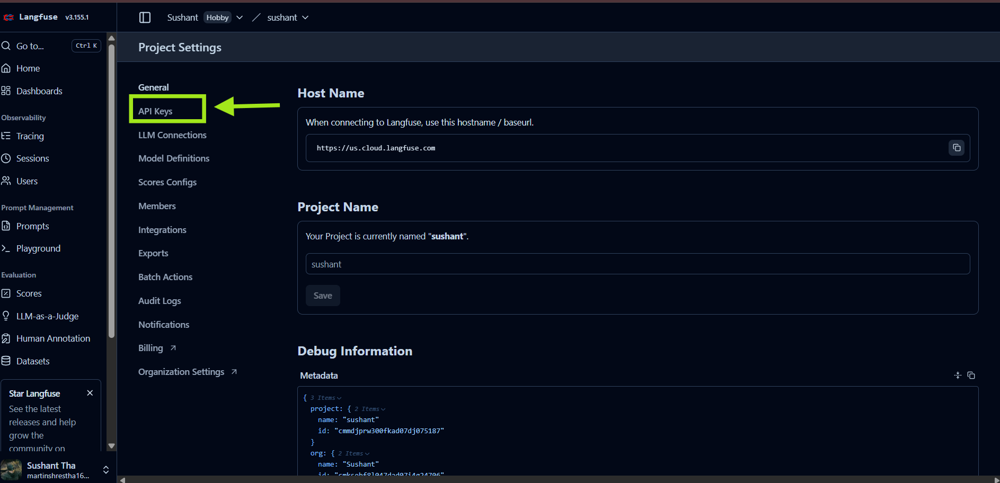
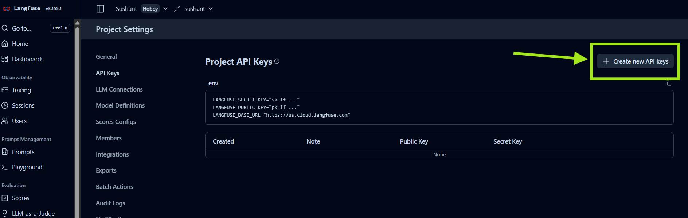
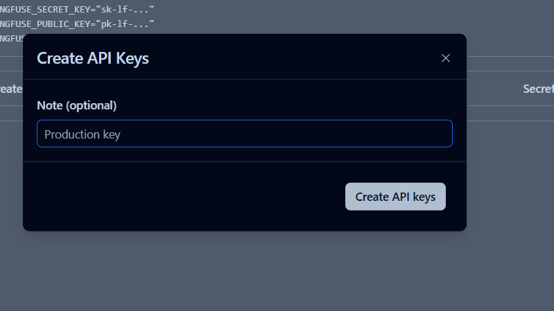
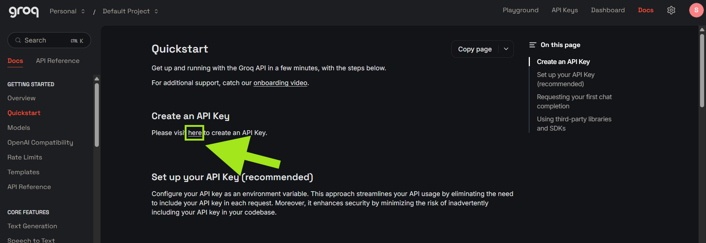
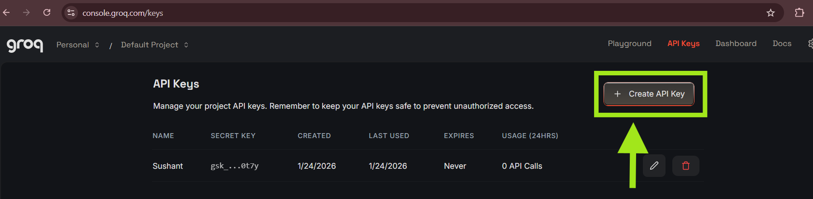
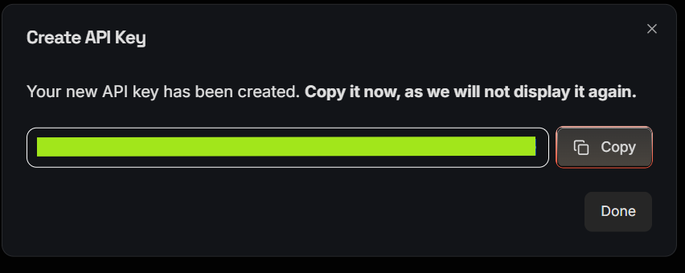

# Lumivya Technology Bootcamp

## Technical Prerequisites & Environment Setup


This bootcamp is hands-on and engineering-focused. To ensure a smooth learning experience, **all participants must complete the following setup before bootcamp**.

Failure to meet the required versions is the **most common cause of dependency and runtime issues** during the bootcamp.

---

## 1. System Requirements

### Hardware

* Personal laptop or desktop
* **Minimum 8 GB RAM** (16 GB recommended)

### Operating System (Any one)

* **macOS** (latest or last 2 major versions)
* **Linux** (Ubuntu 20.04+ recommended)
* **Windows 10 / 11**

  * **WSL2 is strongly recommended** for Windows users

>  Mobile devices (tablets/iPads) are not supported.

---

## 2. Required Software & Versions

> Please follow the **official documentation links only** to avoid incorrect installations.

### 2.1 Node.js & npm

* **Node.js:** `>= 20.9.0`
* **npm:** Bundled with Node.js

 Documentation:

* Node.js: [https://nodejs.org/en/docs](https://nodejs.org/en/docs)
* Next.js Installation Guide: [https://nextjs.org/docs/getting-started/installation](https://nextjs.org/docs/getting-started/installation)
* nvm (Recommended): [https://github.com/nvm-sh/nvm](https://github.com/nvm-sh/nvm)

> ❗ Node.js `18.x or lower` is **NOT supported** (Next.js requirement).

Verify:

```bash
node -v
npm -v
```

---

### 2.2 Python

* **Python:** `>= 3.12`

 Documentation:

* Python Downloads: [https://www.python.org/downloads/](https://www.python.org/downloads/)
* Python Docs: [https://docs.python.org/3/](https://docs.python.org/3/)
* pyenv (Recommended): [https://github.com/pyenv/pyenv](https://github.com/pyenv/pyenv)

Verify:

```bash
python --version
# or
python3 --version
```

---

### 2.3 uv (Python Package Manager)

`uv` is used for fast and reliable Python dependency management.

 Documentation:

* uv: [https://docs.astral.sh/uv/](https://docs.astral.sh/uv/)

Install:

```bash
pip install uv
```

Verify:

```bash
uv --version
```

---

### 2.4 Make

Make is required to run standardized project commands via `Makefile`.

 Documentation:

* GNU Make Manual: [https://www.gnu.org/software/make/manual/make.html](https://www.gnu.org/software/make/manual/make.html)

Install:

* macOS: `xcode-select --install`
* Ubuntu/Linux: `sudo apt install make`
* Windows (WSL): `sudo apt install make`

Verify:

```bash
make --version
```

---

### 2.5 PostgreSQL

* **PostgreSQL:** `>= 14`

 Documentation:

* PostgreSQL Docs: [https://www.postgresql.org/docs/](https://www.postgresql.org/docs/)
* PostgreSQL Downloads: [https://www.postgresql.org/download/](https://www.postgresql.org/download/)

Verify:

```bash
psql --version
```

---

## 3. API Keys (Mandatory)

All participants must create the following API keys **before the bootcamp starts**.

### 3.1 Langfuse API Key

Used for LLM observability and tracing.

 Documentation:

* [https://langfuse.com/docs](https://langfuse.com/docs)

Steps

1. Visit the Langfuse documentation website.
2. Create an account and log in.
3. Navigate to the Organization tab and create a New Project

4. Enter a project name and click Create.

5. After project creation, go to Project Settings → API Keys.

6. Click Create New API Key.

7. (Optional) Add a note/description for the API key and generate it.

8. Copy and Store the API key securely.
>  **Never commit API keys to GitHub or share them publicly.**
---

### 3.2 Groq API Key

Used for LLM inference during hands-on sessions.

 Documentation:

* [https://console.groq.com/docs](https://console.groq.com/docs)

Steps:
1. Visit the Groq console.
2. Create an account and log in.
3. Navigate to the API Keys section.

4. Click Create API Key.

5. Fill in the required details and generate the key.

6. Copy and store the API key securely.

>  **Never commit API keys to GitHub or share them publicly.**

---

## 4. Environment Readiness Checklist

Before joining the bootcamp, confirm:

*  Node.js `>= 20.9.0`
*  Python `>= 3.12`
*  uv installed and working
*  Make available on system
*  PostgreSQL installed and running
*  Langfuse API key created
*  Groq API key created

---

## 5. Important Notes on Compatibility

* Existing installations of Node.js or Python may cause conflicts
* Version mismatch is the **#1 cause of setup issues**
* Strongly recommended:

  * Use **nvm** for Node.js version management
  * Use **pyenv** for Python version management

>  Not following the specified versions may block you during live sessions.

---

## 6. Support & Troubleshooting

If you face issues:

* Raise them **at least 48 hours before** the bootcamp
* Share:

  * OS details
  * Version outputs (`node -v`, `python --version`, etc.)
  * Error logs or screenshots

---

## 7. Final Note

This bootcamp is designed to focus on **learning and building**, not debugging environment issues.

Please complete this setup early.

---

**Lumivya Technology**
*Engineering Excellence Through Practice*
